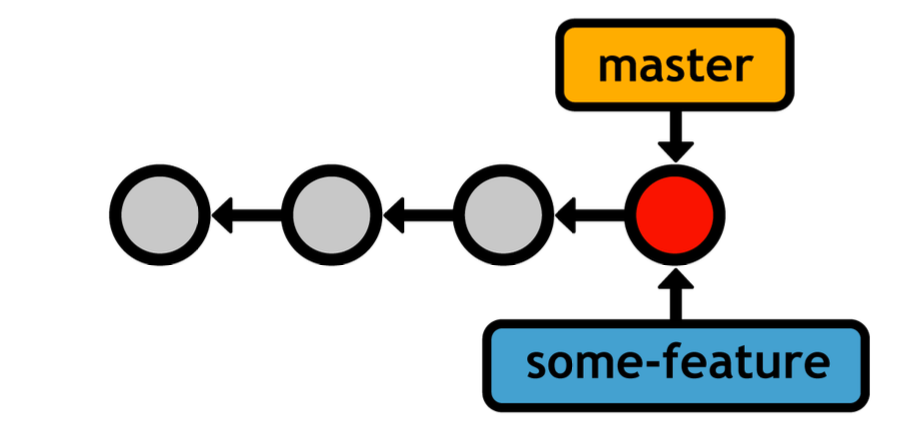
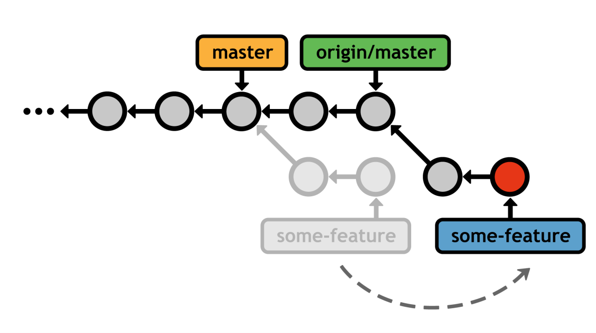

# Tema 10. GIT: Comandos básicos de GIT.


## Initializing Repositories

The only difference between a Git repository and an ordinary project folder is an extra .git directory in the project root. To turn an ordinary project folder into a full-fledged Git repository, run the git init command:
```bash
git init <path>
```	

The ``` <path> ``` argument should be a path to the repository (leaving it blank will use the current working directory).


## Cloning Repositories

As an alternative to git init, you can clone an existing Git repository using the following command:
```bash
git clone ssh://<user>@<host>/path/to/repo.git
```
This logs into the ```<host>``` machine using SSH and downloads the repo.git project. This is a complete copy, not just a link to the server’s repository. You have your own history, working directory, staging area, and branch structure, and no one will see any changes you make until you push them back to a public repository.


## The Staging Area

Git’s staging area gives you a place to organize a commit before adding it to the project history. Staging is the process of moving changes from the working directory to the staged snapshot.

To add new or modified files from the working directory to the staging area, use the following command:
```bash
git add <file>
```
To delete a file from a project, you need to add it to the staging area just like a new or modified file. The next command will stage the deletion and stop tracking the file, but it won’t delete the file from the working directory:
```bash
git rm --cached <file>
```
## Inspecting the Stage
Viewing the status of your repository is one of the most common actions in Git. The following command outputs the state of the working directory and staging area:
```bash
git status
```
This will result in a message that resembles the following (certain sections may be omitted depending on the state of your repository):
```bash
# On branch master
# Changes to be committed:
#
#       new file:   foobar.txt
#
# Changes not staged for commit:
#
#       modified:
#
# Untracked files:
#
#       bar.txt
```

## Commits

Commits represent every saved version of a project, which makes them the atomic unit of Git-based version control. Each commit contains a snapshot of the project, your user information, the date, a commit message, and an SHA-1 checksum of its entire contents:
``` 
commit b650e3bd831aba05fa62d6f6d064e7ca02b5ee1b
Author: john <john@example.com>
Date:   Wed Jan 11 00:45:10 2012 -0600
    Some commit message
```
This checksum serves as a commit’s unique ID, and it also means that a commit will never be corrupted or unintentionally altered without Git knowing about it.

To commit the staged snapshot and add it to the history of the current branch, execute the following:
```bash
git commit
```
You’ll be presented with a text editor and prompted for a “commit message.” Commit messages should take the following form:
```
<commit summary in 50 characters or less.>
<blank line>
<detailed description of changes in this commit.>
```
To skip the text editor and commit directly from the command line, use the following command:
```bash
git commit -m "commit message"
```

## Inspecting Commits

You can display the current branch’s commits with:

```bash
git log
```
### Useful Configurations


To display each commit on a single line, use:
```bash
git log –-oneline
```
To target the history of an individual file instead of the whole repository, use:
```bash
git log --oneline <file>
```
You can use the following to display commits contained in <until> but not in <since>. Both arguments can be a commit ID, a branch name, or a tag:
```bash
#git log <since>..<until>
# Show commits in main that are not in dev
git log dev..main
# Show commits in def456 that are not in abc123
git log abc123..def456 
```

You can display a diffstat of the changes in each commit. This is useful to see what files were affected by a particular commit.
```bash
git log –stat
```


## Manipulating Branches

### Listing Branches
To view your existing branches:
```bash
git branch
```
This will output all of your current branches, along with an asterisk next to the one that’s currently “checked out” :
```
* master
some-feature
quick-bug-fix
```
The master branch is Git’s default branch, which is created with the first commit in any repository. 

### Creating Branches
You can create a new branch by passing the branch name to the same git branch command:
```bash
git branch <name>
```

This creates a pointer to the current HEAD, but does not switch to the new branch (you’ll need git checkout for that). Immediately after requesting a new branch, your repository will look something like the following.


Your current branch (**master**) and the new branch (**some-feature**) both reference the same commit, but any new commits you record will be exclusive to the current branch. If your change your current branch to **some-feature**, your history would look like the following after committing a snapshot.


The new HEAD exists only in the **some-feature** branch. It won’t show up in the log output of master, nor will its changes appear in the working directory after you check out **master**.
You can actually see the new branch in the internal database by opening the file ``` .git/refs/heads/<name> ```. The file contains the ID of the referenced commit, and it is the sole definition of a Git branch. This is the reason branches are so lightweight and easy to manage.

### Deleting Branches
Finally, you can delete branches via the -d flag: 
```bash
git branch -d <name>
```
But, Git’s dedication to never losing your work prevents it from removing branches with unmerged commits. To force the deletion, use the -D flag instead:
```bash
git branch -D <name>
```
Unmerged changes will be lost, so be very careful with this command.

## Checking Out Branches
To switch to a different branch, use the git checkout command:
```bash
git checkout <branch>
```
After checking out the specified branch, your working directory is updated to match the specified branch’s commit. In addition, the **HEAD** is updated to point to the new branch, and all new commits will be stored on the new branch. 

It’s usually a good idea to have a clean working directory before checking out a branch. A clean directory exists when there are no uncommitted changes. If this isn’t the case, git checkout has the potential to overwrite your modifications.

### Detached HEADs

Git also lets you use git checkout with tags and commit IDs, but doing so puts you in a detached HEAD state. This means that you’re not on a branch anymore—you’re directly viewing a commit.


You can look around and add new commits as usual, but since there is no branch pointing to the additions, you’ll lose all your work as soon as you switch back to a real branch. Fortunately, creating a new branch in a detached HEAD state is easy enough:
```bash
git checkout -b <new-branch-name>
```
This is a shortcut for git branch <new-branch-name> followed by git checkout <new-branch-name>. After which, you’ll have a shiny new branch reference to the formerly detached HEAD. This is a very handy procedure for forking experiments off of old revisions.
## Merging Branches

Merging is the process of pulling commits from one branch into another. There are many ways to combine branches, but the goal is always to share information between branches. This makes merging one of the most important features of Git. The two most common merge methodologies are:

- The “fast-forward” merge
- The “3-way” merge
  
They both use the same command, git merge, but the method is automatically determined based on the structure of your history. In each case, the branch you want to merge into must be checked out, and the target branch will remain unchanged. The next two sections present two possible merge scenarios for the following commands:
```bash
git checkout master
git merge some-feature
```
Again, this merges the some-feature branch into the master branch, leaving the former untouched. You’d typically run these commands once you’ve completed a feature and want to integrate it into the stable project.

### Fast-Forward Merges

The fast-forward merge is the simplest merge strategy. It occurs when the target branch’s history has diverged from the source branch, but there is a clear path from the source to the target. In this case, Git simply moves the target branch forward to the source branch’s commit. The following diagram illustrates a fast-forward merge:

We created a branch to develop some new feature, added two commits, and now it’s ready to be integrated into the main code base. Instead of rewriting the two commits missing from master, Git can “fast-forward” the master branch’s pointer to match the location of some-feature. This is the result:


### 3-Way Merges

In this scenario, we added a commit to the master branch while we were still developing some-feature:


When we try to merge some-feature into master, Git will recognize that the two branches have diverged and will perform a 3-way merge. This is a more complex process that involves finding the common ancestor of the two branches and merging the changes from the two branch tips. The result is a new commit that combines the changes from both branches:


### Resolving Merge Conflicts

If you try to combine two branches that make different changes to the same portion of code, Git won’t know which version to use. This is called a merge conflict. Obviously, this can never happen during a fast-forward merge. When Git encounters a merge conflict, you’ll see the following message:

```
Auto-merging index.html
CONFLICT (content): Merge conflict in <file>
Automatic merge failed; fix conflicts and then commit
the result
```

Every file with a conflict is stored under the “Unmerged paths” section. Git
annotates these files to show you the content from both versions:
```
<<<<<<< HEAD
This content is from the current branch.
=======
This is a conflicting change from another branch.
>>>>>>> some-feature
```
The part before the ======= is from the master branch, and the rest is from the
branch you’re trying to integrate.
To resolve the conflict, get rid of the <<<<<<, =======, and >>>>>>> notation,
and change the code to whatever you want to keep. Then, tell Git you’re done
resolving the conflict with the git add command and complete the 3-way merge by generating the merge commit:
```bash
git add <file>
git commit

```
The log message is seeded with a merge notice, along with a “conflicts” list,
which can be particularly useful when trying to figure out where something went
wrong in a project.

## Remote Branches

Commits may be the atomic unit of Git-based version control, but branches are
the medium in which remote repositories communicate. Remote branches act
just like the local branches we’ve covered thus far, except they represent a
branch in someone else’s repository.
### Fetching Remote Branches
The act of downloading branches from another repository is called **fetching**. To
fetch a remote branch, you can specify the repository and the branch you’re
looking for:
```bash
git fetch <remote> <branch>
```
Or, if you want to download every branch in ```<remote>```, simply **omit** the branch
name. After fetching, you can see the downloaded branches by passing the **-r**
option to git branch:
```bash
git branch –r
```
This gives you a branch listing that looks something like:
```
origin/master
origin/some-feature
origin/another-feature
```
Remote branches are always prefixed with the remote name (origin/) to
distinguish them from local branches.
Git will never automatically fetch branches to access updated information—you must do this
manually.

### Inspecting Remote Branches
For all intents and purposes, remote branches behave like read-only branches.
You can safely inspect their history and view their commits via git checkout,
but you cannot continue developing them before integrating them into your local
repository. This makes sense when you consider the fact that remote branches
are copies of other users’ commits.
The .. syntax is very useful for filtering log history. For example, the following
command displays any new updates from origin/master that are not in your
local master branch. It’s generally a good idea to run this before merging
changes so you know exactly what you’re integrating:
```bash
git log master..origin/master
```
If this outputs any commits, it means you are behind the official project and you
should probably update your repository. This is described in the next section.
It is possible to checkout remote branches, but it will put you in a detached HEAD
state. This is safe for viewing other user’s changes before integrating them, but
any changes you add will be lost unless you create a new local branch tip to
reference them.

### Merging/Rebasing

Of course, the whole point of fetching is to integrate the resulting remote
branches into your local project. Let’s say you’re a contributor to an open-source
project, and you’ve been working on a feature called some-feature. As the
“official” project (typically pointed to by origin) moves forward, you may want to
incorporate its new commits into your repository. This would ensure that your
feature still works with the bleeding-edge developments.
Fortunately, you can use the exact same git merge command to incorporate
changes from origin/master into your feature branch:
```bash
git checkout some-feature
git fetch origin
git merge origin/master
```	
Since your history has diverged, this results in a 3-way merge, after which your
some-feature branch has access to the most up-to-date version of the official
project.


However, frequently merging with origin/master just to pull in updates
eventually results in a history littered with meaningless merge commits.
Depending on how closely your feature needs to track the rest of the code base,
rebasing might be a better way to integrate changes:
```bash
git checkout some-feature
git fetch origin
git rebase origin/master
```
As with local rebasing, this creates a perfectly linear history free of superfluous
merge commits:


### Pulling
Since the fetch/merge sequence is such a common occurrence in distributed
development, Git provides a pull command as a convenient shortcut:
```bash
git pull origin/master
```
This fetches the origin’s master branch, and then merges it into the current
branch in one step. You can also pass the --rebase option to use git rebase
instead of git merge.

### Pushing
To complement the git fetch command, Git also provides a push command.
Pushing is almost the opposite of fetching, in that fetching imports branches,
while pushing exports branches to another repository.
```bash
git push <remote> <branch>
```
The above command sends the local <branch> to the specified remote
repository. Except, instead of a remote branch, git push creates a local
branch. For example, executing git push Mary my-feature in your local repository will look like the following from Mary’s perspective (your repository will
be unaffected by the push).


Notice that **my-feature** is a local branch in Mary’s repository, whereas it would
be a remote branch had she fetched it herself.