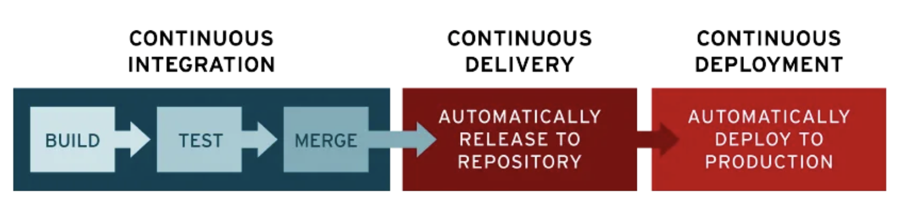

# Tema 12. Metodologías ágiles de desarrollo de software. Estrategias de integración continuo, desarrollo continuo y monitorización continua.

## SCRUM

Scrum es un marco de trabajo ágil para la gestión y desarrollo de proyectos complejos. Se centra en la flexibilidad, la colaboración y la entrega incremental de productos o servicios. Scrum se basa en principios empíricos, lo que significa que se adapta y ajusta en función de la retroalimentación continua y la experiencia acumulada durante el proyecto.

### Pilares fundamentales:
- **Transparencia:** Todos los aspectos del proyecto deben ser visibles y comprensibles para todos los miembros del equipo. Esto incluye el trabajo realizado, los objetivos, los obstáculos y los avances.
- **Inspección:** Se realiza una inspección constante y regular del trabajo completado para identificar desviaciones y oportunidades de mejora. Esta inspección ayuda a mantener un enfoque constante en la calidad y el progreso del proyecto.
- **Adaptación:** Se realizan ajustes y cambios en función de los resultados de la inspección. Estos ajustes se llevan a cabo de manera colaborativa para garantizar la mejora continua y la maximización del valor entregado.

### Roles:
- **Product Owner:** es el responsable de definir y priorizar los elementos del producto. Su objetivo principal es maximizar el valor del producto y garantizar que se satisfagan las necesidades de los clientes y las partes interesadas. El Product Owner trabaja en estrecha colaboración con el equipo de desarrollo para asegurarse de que las funcionalidades más valiosas se implementen en el producto final. Un buen Product Owner debe tener habilidades de liderazgo, pensamiento estratégico y capacidad para tomar decisiones. También debe tener una comprensión profunda de los objetivos del negocio y las necesidades de los clientes. La comunicación efectiva y la capacidad para colaborar con el equipo de desarrollo son también habilidades clave para un Product Owner exitoso.

- **Scrum Master:** es el facilitador y guardián del proceso Scrum. Su función principal es garantizar que el equipo de desarrollo siga las prácticas y principios de Scrum de manera adecuada. El Scrum Master elimina los obstáculos que puedan afectar la productividad del equipo y promueve un ambiente de trabajo colaborativo y de aprendizaje continuo. Idealmente, se recomienda tener un Scrum Master dedicado en todos los proyectos, aunque en proyectos más pequeños o en equipos altamente autónomos, el rol de **Scrum Master** puede ser asumido por un miembro del **equipo de desarrollo**.

- **Equipo de Desarrollo**: es responsable de llevar a cabo el trabajo necesario para entregar los incrementos de producto. El equipo es multifuncional y autoorganizado, lo que significa que tiene la libertad y la responsabilidad de decidir cómo se realizará el trabajo. El equipo colabora estrechamente con el Product Owner para comprender y satisfacer los requisitos del producto.

### Artefactos:
- **Product Backlog:** es una lista ordenada de todos los elementos que componen el producto. Estos elementos son las funcionalidades, características y mejoras que se deben implementar. El **Product Owner** es responsable de mantener el Product Backlog actualizado y priorizado en función del valor que aporta cada elemento al producto.

- **Sprint Backlog:** es una lista de elementos seleccionados del Product Backlog que el equipo de desarrollo se compromete a completar durante un Sprint. El **Sprint Backlog** es creado por el **equipo de desarrollo** y refleja el trabajo que se llevará a cabo en un período de tiempo acordado llamado **Sprint**.

- **Incremento de Producto:**  es la suma de todos los elementos del **Product Backlog** completados durante un **Sprint**. El Incremento debe ser *“Potencialmente Entregable”*, lo que significa que cumple con la definición de *“Terminado”* establecida por el equipo de desarrollo. Cada incremento agrega valor al producto y está listo para ser entregado a los clientes o usuarios finales.

### Cliclo de vida:
- **Sprint Planning:** es una reunión que marca el inicio de un **Sprint**. Durante esta reunión, el **equipo de desarrollo** y el **Product Owner** colaboran para seleccionar y definir los elementos del **Product Backlog** que se incluirán en el **Sprint Backlog**. El equipo también establece el objetivo del **Sprint** y crea un plan para lograrlo.

- **Daily Scrum:** es una breve reunión que se lleva a cabo todos los días durante un Sprint. En esta reunión, el **equipo de desarrollo** comparte su progreso, identifica posibles obstáculos y sincroniza sus actividades. El **Scrum Master** facilita la reunión y ayuda a mantenerla enfocada y efectiva.

- **Sprint Review:** es una reunión que se lleva a cabo al final de cada Sprint. Durante esta reunión, el **equipo de desarrollo** presenta el **Incremento de Producto** completado y recibe retroalimentación de los **stakeholders**. El objetivo principal de la **Sprint Review** es revisar el trabajo realizado y obtener información para ajustar el **Product Backlog**.

- **Sprint Retrospective:** es una reunión que se realiza después de la **Sprint Review**. En esta reunión, el equipo de desarrollo reflexiona sobre el **Sprint** anterior y busca oportunidades de mejora. Se identifican fortalezas y debilidades, y se establecen acciones para optimizar el proceso y el trabajo futuro.

### Beneficios de Scrum:

- **Flexibilidad:**  Scrum permite una mayor adaptabilidad a medida que los requisitos y las necesidades cambian con el tiempo. La flexibilidad inherente a Scrum permite ajustes rápidos y una respuesta ágil a los cambios en el mercado o las demandas del cliente.
- **Mayor transparencia:** La visibilidad y la transparencia son fundamentales en Scrum. Todos los miembros del equipo tienen acceso a la información y pueden seguir el progreso y los obstáculos en tiempo real. Esto fomenta la comunicación abierta y la colaboración efectiva.
- **Entregas frecuentes:** Scrum se basa en entregas incrementales, lo que significa que se entregan productos o funcionalidades terminadas en intervalos regulares. Esto permite obtener retroalimentación temprana y realizar ajustes según sea necesario, lo que a su vez reduce el riesgo de errores costosos a largo plazo.
- **Mayor calidad del producto:** Al adoptar prácticas como la inspección continua y la retroalimentación constante, Scrum promueve la mejora de la calidad del producto. Los equipos de desarrollo pueden identificar y abordar problemas de manera oportuna, lo que resulta en un producto final más sólido y satisfactorio.
- **Mayor satisfacción del cliente:** Al involucrar al cliente de manera activa y continua a lo largo del proyecto, Scrum permite un mayor nivel de satisfacción del cliente. Los clientes tienen la oportunidad de proporcionar retroalimentación, influir en el proceso de desarrollo y ver resultados tangibles de manera regular.

### Sprint

Un **Sprint** es un período de tiempo fijo y corto durante el cual se lleva a cabo el trabajo necesario para completar un conjunto de elementos del **Product Backlog**. La duración de un Sprint suele ser de **1 a 4 semanas**, y se mantiene constante a lo largo del proyecto. Durante un **Sprint**, el equipo de desarrollo se compromete a completar un **Incremento de Producto** que cumple con la definición de *“Terminado”* establecida por el **equipo de desarrollo**.

Si los requisitos cambian durante un **Sprint**, el **equipo de desarrollo** y el **Product Owner** deben colaborar para evaluar el impacto de los cambios y determinar la mejor manera de abordarlos. Si los cambios son significativos, es posible que sea necesario interrumpir el **Sprint** actual y comenzar uno nuevo con los nuevos requisitos. La adaptabilidad y la capacidad de respuesta a los cambios son parte integral de Scrum.

## CI/CD

La **integración continua (CI)** es una práctica que consiste en incorporar los cambios de código a un repositorio compartido de código fuente de forma automática y periódica. La **distribución continua, o implementación continua, (CD)** es un proceso de dos partes en el que se integran, prueban y distribuyen los cambios de código. Mientras que en la distribución los cambios no se llegan a implementar en la producción de forma automatizada, en la implementación sí se lanzan las actualizaciones en este entorno automáticamente.

La CI/CD evita errores y fallas de código en las empresas sin interrumpir el ciclo permanente de desarrollo y actualizaciones de software.

Sus funciones pueden ayudar a disminuir la complejidad, aumentar la eficiencia y optimizar los flujos de trabajo a medida que crecen las aplicaciones.

La CI/CD automatiza la intervención manual que suele necesitarse para que el código nuevo pase de la etapa de confirmación a la de producción, lo cual reduce el tiempo de inactividad y agiliza los lanzamientos de código. Además, dado que integra las actualizaciones y los cambios de código en menos tiempo, los comentarios de los usuarios se incorporan con mayor frecuencia y efectividad, lo cual produce resultados positivos para ellos y un mayor nivel de conformidad de los clientes en general. 

### La integración continua
La parte "CI" de la sigla CI/CD siempre significa integración continua y se trata de un proceso de automatización con el cual los desarrolladores fusionan los cambios de código en un sector o sitio compartido con mayor facilidad y frecuencia. A medida que se realizan las actualizaciones, se activan los pasos de pruebas automatizadas para garantizar que los cambios de código que se fusionaron sean confiables.

El objetivo del diseño de las aplicaciones modernas es que los desarrolladores puedan trabajar de forma simultánea en distintas funciones de la misma aplicación. Sin embargo, si una empresa fusiona todo el código fuente diversificado en un solo día (conocido como el "día de la fusión"), las tareas pueden tornarse tediosas, manuales y muy lentas.

Esto ocurre porque puede haber incompatibilidad entre los cambios que implementen los desarrolladores en la aplicación si trabajan de forma simultánea pero aislada. El problema puede agravarse aún más si cada desarrollador personaliza su propio entorno de desarrollo integrado (IDE) local, en lugar de que todo el equipo adopte un IDE basado en la nube.

La CI puede pensarse como una solución al problema de que se desarrollen demasiadas divisiones de una aplicación al mismo tiempo, que luego podrían entrar en conflicto entre sí.

Para que la integración continua tenga éxito, una vez que se incorporan las modificaciones del desarrollador, se validan con la compilación automática de la aplicación y la ejecución de distintas pruebas automatizadas (generalmente, de unidad e integración), para garantizar que los cambios no hayan introducido una falla. Esto significa que debe probarse todo, desde las clases y el funcionamiento hasta los distintos módulos que conforman toda la aplicación. Si una prueba automática detecta incompatibilidad entre el código nuevo y el actual, la CI facilita la resolución de esos errores con rapidez.

### El significado de "CD" en la sigla CI/CD
La sigla "CD" se refiere a la distribución o la implementación continuas, y se trata de conceptos relacionados que suelen usarse indistintamente. Ambos hacen referencia a la automatización de las etapas posteriores del proceso, pero a veces se usan por separado para explicar hasta dónde llega la automatización. El proceso que se elija dependerá de la tolerancia a los riesgos y las necesidades puntuales de los equipos de desarrollo y operaciones.
#### La distribución continua
Luego de que se automaticen las compilaciones y las pruebas de unidad e integración en la CI, la distribución continua automatiza el lanzamiento de código validado en un repositorio. Por eso, para que este proceso sea eficiente, es esencial que la implementación continua ya esté integrada en el canal de desarrollo.

En todas sus etapas, desde la fusión de los cambios de código hasta la distribución de las compilaciones listas para la producción, las pruebas y el lanzamiento de código están automatizados. Al final de este proceso, el equipo de operaciones puede implementar una aplicación para la producción de forma rápida.

Por lo general, la distribución continua se refiere a que los cambios que implementa un desarrollador en una aplicación se someten a pruebas automáticas de errores y se cargan en un repositorio (como GitHub o un registro de contenedores), para que luego el equipo de operaciones pueda implementarlos en un entorno de producción en vivo. Es la solución al problema de la escasa supervisión y comunicación entre los equipos comerciales y de desarrollo. Por eso, su objetivo es garantizar que cuenten con una base de código que pueda enviarse a un entorno de producción en todo momento y que la implementación de código nuevo requiera un esfuerzo mínimo.

#### La implementación continua
La última etapa de un canal consolidado de CI/CD es la implementación continua. La implementación continua, que es una extensión de la distribución continua, hace referencia al lanzamiento automático de los cambios que implementa el desarrollador desde el repositorio hasta la producción, para ponerlos a disposición de los clientes.

Así, ya no se sobrecarga a los equipos de operaciones con procesos manuales que retrasan la distribución de las aplicaciones. Con este tipo de implementación, se aprovechan los beneficios de la distribución continua y se automatiza la siguiente etapa del proceso.

En la práctica, los cambios que implementan los desarrolladores en la aplicación en la nube podrían ponerse en marcha unos cuantos minutos después de su creación (siempre que hayan pasado las pruebas automatizadas). Esto facilita mucho más la recepción e incorporación permanente de los comentarios de los usuarios. En conjunto, estas prácticas de CI/CD relacionadas reducen los riesgos que conlleva la implementación de una aplicación, dado que es más sencillo realizar cambios a ella en pequeñas partes en lugar de hacerlo todo a la vez. 

No obstante, debido a que no hay ninguna entrada manual en la etapa anterior a la producción, la implementación continua depende en gran medida del correcto diseño de la automatización de las pruebas. Esto implica que requiere de una gran inversión inicial, ya que se deben diseñar las pruebas automatizadas para que se adapten a las distintas etapas de prueba y lanzamiento en el canal de la CI/CD.

#### Diferencias entre la CI/CD y DevOps
La CI/CD es una parte esencial de la metodología DevOps, la cual busca fomentar la colaboración entre los equipos de desarrollo y operaciones. Ambas se centran en la automatización de los procesos que integran código, por lo que agilizan los procesos mediante los cuales una idea (como una función nueva, una solicitud de mejora o la corrección de un error) pasa del desarrollo a la implementación en un entorno de producción, donde puede generar valor para el usuario.

En el marco de trabajo colaborativo de DevOps, la seguridad es una responsabilidad compartida e integrada durante todo el proceso. Es un enfoque tan importante que llevó a que se acuñara el término "DevSecOps" para enfatizar la necesidad de diseñar una base de seguridad en las iniciativas de DevOps. DevSecOps (desarrollo, seguridad y operaciones) es un enfoque que aborda la cultura, la automatización y el diseño de plataformas, el cual integra la seguridad como una responsabilidad compartida a lo largo de todo el ciclo de vida de la TI. Uno de sus elementos fundamentales es la incorporación de un canal de CI/CD seguro.
#### Herramientas comunes de CI/CD
Las herramientas de CI/CD son útiles para que los equipos automaticen el desarrollo, la implementación y las pruebas. Hay algunas que gestionan específicamente la integración (CI), otras que abordan el desarrollo y la implementación (CD), y algunas que se especializan en las pruebas permanentes u otras funciones relacionadas.
- **Tekton Pipelines:** es un marco para las plataformas Kubernetes que ofrece una experiencia estándar de CI/CD en la nube con contenedores.
- **Jenkins:** con capacidad para gestionar desde un servidor de CI sencillo hasta una central de CD completa
- **Spinnaker:** plataforma de CD diseñada para los entornos multicloud
- **GoCD:** servidor de CI/CD que se enfoca en la creación de modelos y la visualización
- **Concourse:** sistema open source de automatización constante
- **Screwdriver:** plataforma de diseño creada para la distribución continua

Es posible que a los equipos también les convenga adquirir las herramientas gestionadas de CI/CD, que ofrecen muchos proveedores. Los principales proveedores de nube pública ofrecen soluciones de CI/CD, junto con **GitLab**, **CircleCI**, **Travis CI**, **Atlassian Bamboo** y muchos más.

Además, es probable que cualquier herramienta que sea fundamental para DevOps forme parte de un proceso de CI/CD. Las herramientas para la automatización de la configuración (como **Ansible**, **Chef** y **Puppet**), los tiempos de ejecución de los contenedores (como **Docker**, **rkt** y **cri-o**) y la organización en contenedores (**Kubernetes**) no son herramientas específicas de CI/CD, pero aparecen en muchos de sus flujos de trabajo.

Hay muchas maneras en que puede implementar CI/CD dependiendo de su estrategia de desarrollo de aplicaciones y su proveedor de nube. **Red Hat® OpenShift® Service** on AWS ofrece varias opciones para simplificar el flujo de trabajo de CI/CD, como **Tekton** y **OpenShift Pipelines**. Al utilizar Red Hat OpenShift, las empresas pueden utilizar CI/CD para automatizar el diseño, prueba e implementación de una aplicación en múltiples plataformas de nube o a nivel local. 

