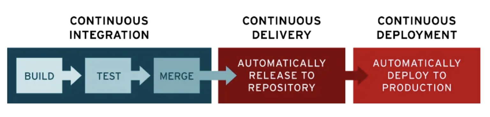

# Esquema T12: SCRUM y CI/CD

---

## SCRUM

### Definición:
SCRUM es un framework de trabajo ágil enfocado en la gestión y desarrollo de proyectos complejos. Se basa en la flexibilidad, colaboración y entrega incremental, utilizando principios empíricos para adaptarse según la retroalimentación continua y experiencia acumulada.

---

### Pilares Fundamentales:
1. **Transparencia**: Visibilidad y comprensión total de todos los aspectos del proyecto por parte de todos los miembros del equipo.
2. **Inspección**: Revisión constante del trabajo completado para detectar desviaciones y mejorar continuamente.
3. **Adaptación**: Ajustes y cambios colaborativos en base a los resultados de la inspección.

---

### Roles en SCRUM:
1. **Product Owner**:
   - Define y prioriza elementos del producto.
   - Su objetivo es maximizar el valor y satisfacer necesidades de clientes y partes interesadas.
   - Colabora con el equipo de desarrollo, con habilidades en liderazgo, pensamiento estratégico, y toma de decisiones.

2. **Scrum Master**:
   - Facilita y garantiza el cumplimiento de prácticas de Scrum.
   - Elimina obstáculos que afectan la productividad y promueve un ambiente colaborativo.

3. **Equipo de Desarrollo**:
   - Encargado de ejecutar el trabajo necesario para entregar incrementos de producto.
   - Es multifuncional y autoorganizado, colaborando estrechamente con el Product Owner.

---

### Artefactos:
1. **Product Backlog**:
   - Lista priorizada de funcionalidades y mejoras a implementar en el producto.
   - Mantenido y actualizado por el Product Owner.

2. **Sprint Backlog**:
   - Lista de elementos seleccionados del Product Backlog a completar en un Sprint.
   - Creado por el equipo de desarrollo.

3. **Incremento de Producto**:
   - Suma de elementos del Product Backlog completados en un Sprint.
   - Debe ser "Potencialmente Entregable", listo para clientes o usuarios.

---

### Ciclo de Vida de SCRUM:
1. **Sprint Planning**:
   - Reunión inicial del Sprint donde se definen elementos a completar y el objetivo del Sprint.

2. **Daily Scrum**:
   - Reunión breve diaria para sincronizar actividades, identificar obstáculos y compartir progreso.

3. **Sprint Review**:
   - Reunión al final de cada Sprint para presentar el Incremento de Producto y recibir retroalimentación de stakeholders.

4. **Sprint Retrospective**:
   - Reunión posterior al Sprint Review para reflexionar y establecer mejoras.

---

### Beneficios de SCRUM:
1. **Flexibilidad**: Adaptación a cambios en requisitos y necesidades.
2. **Mayor transparencia**: Visibilidad y colaboración abierta.
3. **Entregas frecuentes**: Productos funcionales entregados regularmente, permitiendo retroalimentación y ajustes.
4. **Mayor calidad del producto**: Mejora continua mediante inspección y retroalimentación.
5. **Satisfacción del cliente**: Participación activa del cliente y resultados visibles en intervalos regulares.

---

### Sprint
- **Definición**: Período de tiempo fijo (1 a 4 semanas) para completar un conjunto de elementos del Product Backlog.
- **Propósito**: Generar un Incremento de Producto "Terminado".
- **Adaptabilidad**: Si los requisitos cambian, el equipo y el Product Owner evalúan su impacto; en caso de cambios significativos, puede interrumpirse el Sprint y comenzar uno nuevo.

--- 

## CI/CD

### Definición General:
CI/CD es una metodología que integra cambios de código en un repositorio compartido y automatiza su despliegue. Esto permite evitar errores sin interrumpir el ciclo de desarrollo y facilita la incorporación de comentarios de los usuarios, aumentando la satisfacción del cliente.

---

### Componentes Principales de CI/CD:

1. **Integración Continua (CI)**:
   - Proceso en el cual los desarrolladores fusionan cambios de código de manera automática y periódica en un repositorio compartido.
   - Activa pruebas automatizadas para verificar la funcionalidad del código.
   - Evita conflictos de código al realizar fusiones frecuentes, mejorando la eficiencia de los equipos de desarrollo.

2. **Continuous Delivery (CD)**:
   - Automatiza la entrega de código validado en un repositorio.
   - Permite que el equipo de operaciones pueda desplegar el código en producción cuando esté listo.
   - Busca reducir la falta de supervisión entre equipos de desarrollo y operaciones, asegurando una base de código estable para producción.

3. **Continuous Deployment (CD)**:
   - Extensión de la entrega continua, lanzando cambios desde el repositorio de desarrollo al de producción automáticamente.
   - Requiere una adecuada automatización de pruebas, ya que no debe haber intervención manual.
   - Permite despliegues rápidos y ajustes según retroalimentación de los usuarios finales en tiempo real.

---

### Objetivos de CI/CD:
- **Reducción de tiempo de inactividad**: Automatizar el paso del código desde confirmación hasta producción.
- **Integración de cambios rápida**: Incorporar actualizaciones en menor tiempo para adaptarse a las necesidades de los usuarios.
- **Minimización de riesgos**: Realizar cambios en partes pequeñas de la aplicación, en lugar de hacerlo todo a la vez.

---

### CI/CD vs DevOps:
- **CI/CD** es una parte esencial de **DevOps**, que promueve la colaboración entre desarrollo y operaciones.
- **DevSecOps** es una extensión de DevOps que integra la seguridad como responsabilidad compartida a lo largo del ciclo de vida de TI (tecnologías de la información), asegurando un CI/CD seguro y estable.

---

### Herramientas de CI/CD:

1. **Tekton Pipelines**: framework para plataformas Kubernetes que ofrece CI/CD en contenedores en la nube.
2. **Jenkins**: Plataforma versátil que gestiona CI/CD.
3. **Spinnaker**: Plataforma de CD para entornos multicloud.
4. **GoCD**: Servidor de CI/CD enfocado en modelado y visualización.
5. **Concourse**: Sistema open source de automatización continua.
6. **Screwdriver**: Plataforma enfocada en CD.

---