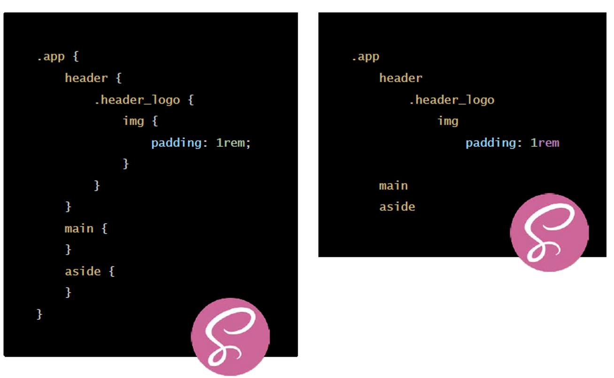

# Tema 6. SASS

## Fundamentos y sintaxis de SASS.

SASS es un preprocesador de CSS que nos permite escribir hojas de estilo de una forma más eficiente y organizada. SASS es un lenguaje de hojas de estilo que se compila a CSS. SASS es un acrónimo de Syntactically Awesome Stylesheets.

Otros preprocesadores de CSS son LESS y Stylus.

El código SASS no se interpreta directamente por los navegadores, por lo que es necesario compilarlo a CSS. Este proceso se llama transpilación.

Versiones de SASS:
- Ruby SASS: La versión original de SASS, escrita en Ruby y obsoleta.
- Dart SASS: La versión actual de SASS, escrita en Dart.

SCSS vs SASS:
- SCSS: Sintaxis de SASS compatible con CSS, con llaves y punto y coma.
- SASS: Sintaxis original de SASS, con indentación.



Entorno de desarrollo para visual code:
- Live Sass Compiler: Extensión de Visual Studio Code que compila archivos SASS/SCSS a CSS en tiempo real.
- Live Server: Extensión de Visual Studio Code que permite visualizar los cambios en el navegador en tiempo real.
- Prettier: Extensión de Visual Studio Code que formatea el código automáticamente.
- SASS: Indented Sass syntax highlighting, autocomplete & Formatter for VSCode (only Sass syntax).
- 
## Uso de variables en SASS.

Las variables en SASS se definen con el símbolo `$` y se asignan con `:`. Podemos almacenar colores, tamaños, fuentes, etc.


Ejemplo de uso de variables en SASS:
```scss
$color-primary: #333;
$color-secondary: #666;

body {
  color: $color-primary;
}
```
CSS resultante:
```css
body {
  color: #333;
}
```

Ámbito de las variables:
Variables declared at the top level of a stylesheet are global. This means that they can be accessed anywhere in their module after they’ve been declared. But that’s not true for all variables. Those declared in blocks (curly braces in SCSS or indented code in Sass) are usually local, and can only be accessed within the block they were declared.
    
```scss
// Global variable
$color: blue;

.foo {
    // Local variable
    $color: red;
    color: $color;
}

.bar {
    color: $color;
}
```
CSS resultante:
```css
.foo {
    color: red;
}

.bar {
    color: blue;
}
```
### Control de flujo
Sass provides a number of at-rules that make it possible to control whether styles get emitted, or to emit them multiple times with small variations. They can also be used in mixins and functions to write small algorithms to make writing your Sass easier. Sass supports four flow control rules.

- **@if** controls whether or not a block is evaluated.

```scss
$color: blue;

.foo {
    @if $color == blue {
        color: blue;
    } @else {
        color: red;
    }
}
```


- **@each** evaluates a block for each element in a list or each pair in a map.

```scss
$colors: (primary: blue, secondary: red);

@each $name, $color in $colors {
    .#{$name} {
        color: $color;
    }
}
```


- **@for** evaluates a block a certain number of times.

```scss

@for $i from 1 through 3 {
    .item-#{$i} {
        width: 2em * $i;
    }
}
```


- **@while** evaluates a block until a certain condition is met.

```scss

$i: 6;

@while $i > 0 {
    .item-#{$i} {
        width: 2em * $i;
    }

    $i: $i - 2;
}
```


## Anidamiento, funciones y mixins en SASS.

**ESTO NO DEBERÍA ENTRAR**

Block-Element-Modifier (BEM) en SASS.
Es un estandar de nomenclatura para clases de CSS. Se basa en la estructura de bloques, elementos y modificadores:
- Bloque: Componente independiente y autónomo.  `.block`
- Elemento: Parte de un bloque que no tiene sentido por sí solo. `.block__element`
- Modificador: Estado o variante de un bloque o elemento. `.block__element--modifier`

```scss
.block {
  &__element {
    &--modifier {
    }
  }
}
```
**FIN: ESTO NO DEBERÍA ENTRAR**

### Anidamiento.

El anidamiento en SASS nos permite usar selectores de la misma manera que en HTML. Esto nos permite escribir hojas de estilo más organizadas y legibles.

Ejemplo de anidamiento en SASS:
```scss
nav {
  ul {
    margin: 0;
    padding: 0;
    list-style: none;
  }

  li {
    display: inline-block;
  }

  a {
    display: block;
    padding: 6px 12px;
    text-decoration: none;
  }
}
```
CSS resultante:
```css
nav ul {
  margin: 0;
  padding: 0;
  list-style: none;
}

nav li {
  display: inline-block;
}

nav a {
  display: block;
  padding: 6px 12px;
  text-decoration: none;
}
```

### Funciones.

Functions allow you to define complex operations on SassScript values that you can re-use throughout your stylesheet. They make it easy to abstract out common formulas and behaviors in a readable way.

Functions are defined using the @function at-rule, which is written @function <name>(<arguments...>) { ... }. A function’s name can be any Sass identifier that doesn’t begin with --. It can only contain universal statements, as well as the @return at-rule which indicates the value to use as the result of the function call. Functions are called using the normal CSS function syntax, with parentheses surrounding the arguments.

Ejemplo de función en SASS:
```scss
@function fibonacci($n) {
  $sequence: 0 1;
  @for $_ from 1 through $n {
    // nth($list, $n) returns the nth item in a list.
    // lists starts at 1, not 0.
    $new: nth($sequence, length($sequence)) + nth($sequence, length($sequence) - 1);
    $sequence: append($sequence, $new);
  }
  @return nth($sequence, length($sequence));
}

.sidebar {
  float: left;
  margin-left: fibonacci(4) * 1px;
}
```
CSS resultante:
```css
.sidebar {
  float: left;
  margin-left: 5px;
}
```

### Mixins.
Mixins allow you to define styles that can be re-used throughout your stylesheet. They make it easy to avoid using non-semantic classes like .float-left, and to distribute collections of styles in libraries.

Mixins are defined using the @mixin at-rule, which is written @mixin <name> { ... } or @mixin name(<arguments...>) { ... }. A mixin’s name can be any Sass identifier that doesn’t begin with --, and it can contain any statement other than top-level statements. They can be used to encapsulate styles that can be dropped into a single style rule; they can contain style rules of their own that can be nested in other rules or included at the top level of the stylesheet; or they can just serve to modify variables.

Mixins are included into the current context using the @include at-rule, which is written @include <name> or @include <name>(<arguments...>), with the name of the mixin being included.

Ejemplo de mixin en SASS:
```scss
@mixin reset-list {
  margin: 0;
  padding: 0;
  list-style: none;
}

@mixin horizontal-list {
  @include reset-list;

  li {
    display: inline-block;
    margin: {
      left: -2px;
      right: 2em;
    }
  }
}

nav ul {
  @include horizontal-list;
}

```
CSS resultante:
```css
nav ul {
  margin: 0;
  padding: 0;
  list-style: none;
}

nav ul li {
  display: inline-block;
  margin-left: -2px;
  margin-right: 2em;
}
```
#### Arguments

Mixins can also take arguments, which allows their behavior to be customized each time they’re called. The arguments are specified in the @mixin rule after the mixin’s name, as a list of variable names surrounded by parentheses. The mixin must then be included with the same number of arguments in the form of SassScript expressions. The values of these expression are available within the mixin’s body as the corresponding variables.

Ejemplo de mixin con argumentos en SASS:
```scss
@mixin rtl($property, $ltr-value, $rtl-value) {
  #{$property}: $ltr-value;
    // If the direction is right-to-left, set the property to the RTL value.
  [dir=rtl] & {
    #{$property}: $rtl-value;
  }
}

.sidebar {
  @include rtl(float, left, right);
}
```
CSS resultante:
```css

.sidebar {
  float: left;
}

[dir=rtl] .sidebar {
  float: right;
}
```

Podemos usar argumentos opcionales en los mixins, que se definen con un valor por defecto:
```scss
@mixin replace-text($image, $x: 50%, $y: 50%) {
  text-indent: -99999em;
  overflow: hidden;
  text-align: left;

  background: {
    image: $image;
    repeat: no-repeat;
    position: $x $y;
  }
}

.mail-icon {
  @include replace-text(url("/images/mail.svg"), 0);
}
// podemos llamar al mixin citando el nombre de los argumentos

.mail-icon2 {
  @include replace-text($image: url("/images/mail.svg"), $y: 20);
}       
```
CSS resultante:
```css
.mail-icon {
  text-indent: -99999em;
  overflow: hidden;
  text-align: left;
  background-image: url("/images/mail.svg");
  background-repeat: no-repeat;
  background-position: 0 50%;
}

.mail-icon2 {
  text-indent: -99999em;
  overflow: hidden;
  text-align: left;
  background-image: url("/images/mail.svg");
  background-repeat: no-repeat;
  background-position: 50% 20%;
}
```
#### Taking Arbitrary Arguments

Sometimes it’s useful for a mixin to be able to take any number of arguments. If the last argument in a @mixin declaration ends in ..., then all extra arguments to that mixin are passed to that argument as a list. This argument is known as an argument list.

```scss
@mixin order($height, $selectors...) {
  @for $i from 0 to length($selectors) {
    #{nth($selectors, $i + 1)} {
      position: absolute;
      height: $height;
      margin-top: $i * $height;
    }
  }
}

@include order(150px, "input.name", "input.address", "input.zip");

```
CSS resultante:
```css
input.name {
  position: absolute;
  height: 150px;
  margin-top: 0;
}

input.address {
  position: absolute;
  height: 150px;
  margin-top: 150px;
}

input.zip {
  position: absolute;
  height: 150px;
  margin-top: 300px;
}
```


## Estructura y organización de proyectos con SASS.

### El Patron 7-1

7 carpetas diferentes, y un único archivo en el directorio raíz (normalmente llamado main.scss) y que importa todas estas partes para luego compilarlas en una hoja de estilo CSS.

```python
sass/
|
|– base/
|   |– _reset.scss       # Reset/normalize
|   |– _typography.scss  # Reglas tipográficas
|   …                    # Etc.
|
|– components/
|   |– _buttons.scss     # Botones
|   |– _carousel.scss    # Carousel
|   |– _cover.scss       # Cubierta
|   |– _dropdown.scss    # Dropdown
|   …                    # Etc.
|
|– layout/
|   |– _navigation.scss  # Navegación
|   |– _grid.scss        # Sistema de retícula
|   |– _header.scss      # Encabezamiento
|   |– _footer.scss      # Pie de página
|   |– _sidebar.scss     # Barra lateral
|   |– _forms.scss       # Formularios
|   …                    # Etc.
|
|– pages/
|   |– _home.scss        # Estilos específicos para la página de inicio
|   |– _contact.scss     # Estilos específicos para la página de contacto
|   …                    # Etc.
|
|– themes/
|   |– _theme.scss       # Tema por defecto
|   |– _admin.scss       # Tema del administrador
|   …                    # Etc.
|
|– utils/
|   |– _variables.scss   # Variables Sass
|   |– _functions.scss   # Funciones Sass
|   |– _mixins.scss      # Mixins Sass
|   |– _helpers.scss     # Clases & placeholders
|
|– vendors/
|   |– _bootstrap.scss   # Bootstrap
|   |– _jquery-ui.scss   # jQuery UI
|   …                    # Etc.
|
|
`– main.scss             # Archivo principal de Sass que carga todos los demás archivos
```

### @use y @forward

@use se utiliza para importar módulos de Sass. @use carga el módulo y lo almacena en una variable y lo hace accesible a través de un espacio de nombres que por defecto es el nombre del módulo.

```scss
// _variables.scss
$color-primary: #333;
$color-secondary: #666;
````

```scss
// main.scss
@use 'variables';

body {
  color: variables.$color-primary;
}
```

Podemos especificar el espacio de nombres:
```scss
// main.scss
@use 'variables' as vars;

body {
  color: vars.$color-primary;
}
```


Podemos cargar un módulo y reexportar sus miembros con @forward:
```scss
// _variables.scss
$color-primary: #333;
$color-secondary: #666;
```
```scss
// _index.scss
@forward 'variables';
```
```scss
// main.scss
@use 'index';

body {
  color: index.$color-primary;
}
```

Podemos cargar un modulo por su carpeta si esta contiene un archivo _index.scss.


A stylesheet can define variables with the !default flag to make them configurable. To load a module with configuration, write @use <url> with (<variable>: <value>, <variable>: <value>). The configured values will override the variables’ default values.
    
```scss
// _variables.scss
$color: blue !default;
```
```scss
// main.scss
@use 'variables' with ($color: red);

body {
color: variables.$color;
}
```

The @forward rule can also load a module with configuration. This mostly works the same as it does for @use, with one addition: a @forward rule’s configuration can use the !default flag in its configuration. This allows a module to change the defaults of an upstream stylesheet while still allowing downstream stylesheets to override them.
```scss
// _variables.scss
$color: blue !default;
```
```scss
// _index.scss
@forward 'variables' with ($color: red);
```
```scss
// main.scss
@use 'index';

body {
color: index.$color;
}
```
