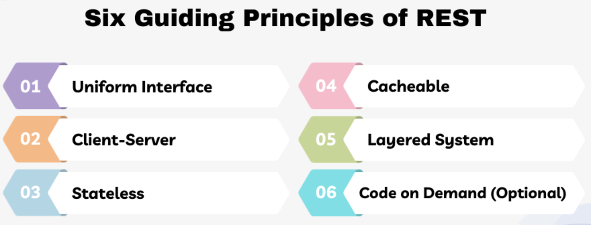

# Tema 7. Arquitectura cliente/servidor
– Arquitectura orientada a servicios (SOA).
– Servicios Web SOAP. Descripción y descubrimiento de servicios.
– XML y JSON.
– Servicios REST.
– Estándares y seguridad en servicios web y Rest.

## Arquitectura orientada a servicios (SOA).

1. **Definición**
   - Enfoque para hacer componentes de software reutilizables mediante interfaces de servicio.
   - Usa interfaces y arquitectura estandarizada para facilitar integración en nuevas aplicaciones.
   - Evita duplicación de funcionalidades y simplifica interoperabilidad.

2. **Estructura de los Servicios**
   - Cada servicio realiza una función de negocio específica (ej. verificar crédito).
   - Servicios con "acoplamiento dinámico": pueden usarse sin conocimiento profundo de su implementación.

3. **Interfaz de Servicio**
   - Actúa como un contrato entre el proveedor y el consumidor del servicio.
   - Servicios pueden ser desarrollados en distintos lenguajes o adquiridos como aplicaciones empaquetadas, SaaS o de código abierto.
   - Uso de WSDL (basado en XML) para definir interfaces de servicio.

4. **Protocolos de Red**
   - Uso de protocolos estándar como SOAP/HTTP o RESTful HTTP (JSON/HTTP).
   - Permiten enviar solicitudes para leer o modificar datos.

5. **Gobernanza y Publicación**
   - Controla el ciclo de vida de desarrollo de servicios.
   - Servicios se publican en registros para facilitar su descubrimiento y reutilización en nuevas aplicaciones.

6. **Origen de los Servicios**
   - Se crean desde cero o exponiendo funciones de sistemas existentes como servicios.

7. **Impacto y Evolución**
   - Facilita la reutilización y simplifica integraciones respecto a los enfoques previos de integración punto a punto.
   - Representa una evolución en el desarrollo e integración de aplicaciones.


**ESB (Bus de Servicio Empresarial)**

1. **Definición**
   - Arquitectura centralizada para integrar aplicaciones.
   - Funciones clave: transformación de datos, conectividad, direccionamiento, conversión de protocolos y composición de solicitudes.

2. **Función en Integraciones**
   - Facilita la integración mediante una interfaz de servicio reutilizable.
   - Mejora la productividad mediante herramientas especializadas de integración.

3. **Uso en SOA**
   - SOA puede funcionar sin ESB, pero sería complejo y conllevaría conexiones punto a punto difíciles de mantener.
   - ESB se considera esencial en muchas implementaciones de SOA; los términos a menudo se usan como sinónimos.


### Ventajas de SOA

1. **Agilidad y Rapidez de Comercialización**
   - Facilita el desarrollo rápido de aplicaciones mediante la reutilización de servicios.
   - Permite integración de aplicaciones y automatización de procesos de negocio, reduciendo el tiempo en tareas de integración.

2. **Aprovechamiento de Funcionalidad Existente**
   - SOA permite reutilizar y expandir la funcionalidad de sistemas legados a nuevos entornos y mercados.
   - Ejemplo: Exposición de funcionalidades de sistemas financieros en mainframes a aplicaciones web.

3. **Mejora en la Colaboración Negocio-TI**
   - Servicios definidos en términos de negocio facilitan la comunicación entre analistas y desarrolladores.
   - Mejora la alineación entre objetivos empresariales y desarrollos tecnológicos.

### Ejemplos de SOA

1. **Delaware Electric**
   - Integró sistemas aislados, mejorando la eficiencia de desarrollo y soportando un congelamiento de tarifas.

2. **Cisco**
   - Utilizó SOA para unificar el proceso de pedidos en productos y canales, permitiendo a socios incorporar servicios en sus plataformas.

3. **Independence Blue Cross (IBC)**
   - Implementó una "única fuente de verdad" para asegurar que todos los actores trabajen con datos consistentes de los pacientes.

### SOA vs. Microservicio

1. **Ámbito de Aplicación**
   - **SOA:** Arquitectura de integración a nivel empresarial. Expone funciones de negocio para reutilización en distintas aplicaciones, facilitando la comunicación entre partes de una organización extendida.
   - **Microservicios:** Arquitectura de aplicaciones de ámbito específico. Divide una sola aplicación en componentes pequeños, independientes y manejables.

2. **Acoplamiento**
   - **SOA:** Enfocado en acoplamiento más flexible, pero a menudo requiere integraciones centralizadas como el ESB.
   - **Microservicios:** Desacoplamiento total, donde cada componente puede modificarse, probarse y desplegarse independientemente.

### Ventajas de Microservicios en Entornos Modernos

1. **Agilidad y Productividad**
   - Permite actualizar partes específicas de una aplicación sin afectar al resto, acelerando ciclos de desarrollo.

2. **Escalabilidad**
   - Componentes pueden escalarse de forma independiente, optimizando recursos en la nube.

3. **Resiliencia**
   - Fallos en un microservicio no afectan a otros; cada uno puede gestionar su disponibilidad de manera autónoma.

### Impacto en la Integración (Relación con ESB)

- La arquitectura de microservicios puede descentralizar el ESB tradicional, evitando cuellos de botella y mejorando la flexibilidad.
- Este enfoque de "integración ágil" facilita la adaptabilidad y evita la dependencia de un equipo central de integración.


## Servicios Web SOAP. Descripción y descubrimiento de servicios.

SOAP (Simple Object Access Protocol) es un protocolo de comunicación basado en XML que permite la interacción entre aplicaciones distribuidas y sistemas heterogéneos.

Fue desarrollado por Microsoft, IBM y otros en 1998 y ha sido ampliamente adoptado en la industria como un estándar abierto para la integración de aplicaciones.

SOAP utiliza XML (Extensible Markup Language) para definir el formato de los mensajes y permite la comunicación entre aplicaciones a través de HTTP (Hypertext Transfer Protocol) o SMTP (Simple Mail Transfer Protocol).

Esto permite que las aplicaciones se comuniquen entre sí de manera independiente del lenguaje de programación, plataforma o sistema operativo.

SOAP se basa en un modelo de solicitud-respuesta, donde una aplicación cliente envía una solicitud a un  servidor SOAP y recibe una respuesta.

El protocolo SOAP define un conjunto de reglas para la estructura de los mensajes, incluyendo la definición de la estructura de los mensajes, la serialización de datos y la autenticación.

### Definición de SOAP

SOAP se define como un protocolo de comunicación de aplicación a aplicación que utiliza XML para definir la estructura de los mensajes y permite la comunicación entre aplicaciones distribuidas.

La especificación de SOAP define los siguientes componentes clave:
- Envelope: el contenedor de la solicitud o respuesta que incluye la cabecera y el cuerpo del mensaje.
- Header: la sección de la cabecera del mensaje que contiene información de autenticación, direcciones y otros metadatos.
- Body: la sección del cuerpo del mensaje que contiene la solicitud o respuesta en sí.

La estructura de un mensaje SOAP se puede representar como:

```xml
<?xml version="1.0" encoding="UTF-8"?>
<SOAP-ENV:Envelope>
    <SOAP-ENV:Header>
        <Autenticación>
            <Usuario>usuario</Usuario>
            <Contraseña>contraseña</Contraseña>
        </Autenticación>
    </SOAP-ENV:Header>
    <SOAP-ENV:Body>
        <getDatos>
            <dato>valor</dato>
        </getDatos>
    </SOAP-ENV:Body>
</SOAP-ENV:Envelope>
```

### Beneficios de utilizar servicios web SOAP
- **Interoperabilidad:** La capacidad de comunicación entre diferentes plataformas y lenguajes de programación es una de las mayores ventajas de utilizar servicios web SOAP.
- **Reusabilidad de código:** Los servicios web SOAP permiten reutilizar código y reducir la complejidad en la creación de aplicaciones. Esto se logra gracias a que pueden ser accedidas por diferentes aplicaciones.
- **Mayor eficiencia:** los desarrolladores pueden centrarse en crear lógica de negocio en lugar de preocuparse por la complejidad de la comunicación entre sistemas.
- **Mejora de la seguridad:** Los servicios web SOAP ofrecen una capa adicional de seguridad, ya que los mensajes se envían a través de un protocolo seguro y autenticado.

### Ventajas de la interoperabilidad con SOAP
- **Comunicación entre diferentes sistemas:** Los servicios web SOAP permiten que diferentes sistemas y aplicaciones se comuniquen entre sí de manera efectiva, independientemente del lenguaje de programación o plataforma utilizada.
- **Reutilización de código:** La interoperabilidad permite reutilizar código y reducir la complejidad en la creación de aplicaciones.
- **Mayor flexibilidad:** La capacidad de comunicación entre diferentes plataformas y lenguajes de programación ofrece una mayor flexibilidad en la creación de aplicaciones.

### Seguridad en la comunicación con SOAP

Los servicios web SOAP ofrecen una capa adicional de seguridad, ya que los mensajes se envían a través de un protocolo seguro y autenticado.

Entre las medidas de seguridad implementadas en los servicios web SOAP se encuentran:
- Autenticación
- Mensaje cifrado
- Firma digital para garantizar la integridad y autenticidad de los mensajes.
- Otros mecanismos de seguridad, como la autorización y la autenticación de dos factores, para garantizar la seguridad en la comunicación entre sistemas y aplicaciones.

### Escalabilidad y flexibilidad con servicios web SOAP

Los  servicios web SOAP ofrecen una mayor escalabilidad y flexibilidad en la creación de aplicaciones, lo que las hace ideales para entornos empresariales que requieren una alta disponibilidad y rendimiento.

Entre las características que permiten esta escalabilidad y flexibilidad se encuentran:
- **Arquitectura modular:** La arquitectura modular de los servicios web SOAP permite agregar o eliminar componentes según sea necesario, lo que facilita la escalabilidad y flexibilidad.
- **Reutilización de código:** La reutilización de código es una característica clave de los servicios web SOAP, ya que permite reducir la complejidad y el tiempo de desarrollo.
- **Flexibilidad en la implementación:** Los servicios web SOAP permiten una gran flexibilidad en la implementación, lo que permite adaptarse a las necesidades específicas de cada empresa.

### Desventajas y limitaciones de SOAP


- **Complejidad en la implementación de SOAP:** Una de las principales desventajas de SOAP es la complejidad en su implementación. La creación de un servicio web basado en SOAP requiere un conocimiento profundo de la tecnología y de los estándares de XML.

Además, la implementación de SOAP implica la gestión de **WSDL (Web Service Description Language)**, que es un lenguaje de descripción de servicios web que define la interfaz de un servicio web.

La complejidad en la implementación de SOAP se debe a la necesidad de crear un WSDL para describir la interfaz del servicio web, lo que puede ser un proceso complicado.

Además, la implementación de SOAP también implica la gestión de la serialización y deserialización de objetos, lo que puede ser un proceso complejo.

Otra razón por la que la implementación de SOAP puede ser complicada es porque requiere la gestión de la seguridad. SOAP utiliza XML para enviar y recibir datos, lo que hace que sea vulnerable a ataques de seguridad.Por lo tanto, es necesario implementar mecanismos de seguridad adicionales para proteger la integridad de los datos.

### Problemas de rendimiento con grandes cantidades de datos
Otra desventaja de SOAP es que puede ser lento en comparación con otros protocolos de servicios web.

Esto se debe a que SOAP utiliza XML para enviar y recibir datos, lo que puede generar un gran tamaño de archivo. Esto puede ser un problema cuando se trabajan con grandes cantidades de datos.

Además, la serialización y deserialización de objetos en SOAP también puede ser un proceso lento. Esto se debe a que la serialización y deserialización de objetos implica la conversión de objetos en cadenas de texto y viceversa, lo que puede requerir una gran cantidad de recursos del sistema.

Para mejorar el rendimiento de SOAP, es posible utilizar técnicas de optimización como la compresión de datos y la utilización de caching. Sin embargo, estas técnicas pueden ser complicadas de implementar y no siempre son efectivas.

### Incompatibilidades con otros protocolos de servicios web
Otra desventaja de SOAP es que puede ser incompatible con otros protocolos de servicios web. Esto se debe a que SOAP utiliza un formato de mensaje específico que no es compatible con otros protocolos. Por ejemplo, SOAP no es compatible con  **REST (Representational State of Resource)**, que es otro protocolo de servicios web popular.

Esto puede ser un problema cuando se intenta integrar servicios web basados en SOAP con servicios web basados en REST.

Además, SOAP también puede ser incompatible con otros protocolos de servicios web como **JSON-RPC (JavaScript Object Notation-Remote Procedure Call)** y **XML-RPC (Extensible Markup Language-Remote Procedure Call)**.

Esto puede ser un problema cuando se intenta integrar servicios web basados en SOAP con servicios web basados en otros protocolos.


### XML (Extensible Markup Language)

XML es un lenguaje flexible y extensible que permite estructurar datos de forma jerárquica, facilitando su intercambio y almacenamiento.

### Características Principales

1. **Prólogo de XML:**
   - El documento XML puede (y normalmente debe) empezar con un prólogo opcional, que declara la versión de XML y la codificación de caracteres.
   - Ejemplo de prólogo: `<?xml version="1.0" encoding="UTF-8"?>`

2. **Estructura de Datos Jerárquica:**
   - XML organiza la información en una estructura de árbol, donde los elementos pueden anidarse.
   - Ideal para representar datos estructurados, como configuraciones o información de bases de datos.

3. **Un Solo Elemento Raíz:**
   - Un documento XML debe tener **un único elemento raíz** que contenga todos los demás elementos. Esto garantiza una estructura consistente.
   - Ejemplo: en `<libros>`, todos los datos de libros están dentro de este único elemento raíz.

4. **Etiquetas Definidas por el Usuario:**
   - XML permite definir etiquetas personalizadas que describen el contenido específico, lo que lo hace muy versátil.
   - A diferencia de HTML, las etiquetas no tienen significado predeterminado.

5. **Legibilidad para Humanos y Máquinas:**
   - XML está diseñado para ser legible tanto por humanos como por máquinas, lo que facilita la interoperabilidad.

6. **Validación de Datos:**
   - Para asegurar la estructura, XML se puede validar mediante **Document Type Definition (DTD)** o **XML Schema (XSD)**, lo cual es útil para garantizar que el documento cumple con un formato específico.

7. **Atributos y Valores:** 
   - Los elementos pueden tener atributos para proporcionar información adicional.
   - Ejemplo: `moneda="USD"` en `<precio moneda="USD">29.99</precio>`.

### Ejemplo Completo de XML

```xml
<?xml version="1.0" encoding="UTF-8"?>
<libros>
    <libro>
        <titulo>Aprendiendo XML</titulo>
        <autor>Juan Pérez</autor>
        <precio moneda="USD">29.99</precio>
    </libro>
    <libro>
        <titulo>Programación Avanzada</titulo>
        <autor>María López</autor>
        <precio moneda="EUR">39.99</precio>
    </libro>
</libros>
```

### Sintaxis y Reglas

1. **Un Elemento Raíz Único:** Solo puede haber un elemento raíz, en este caso, `<libros>`.
2. **Etiquetas de Apertura y Cierre Coincidentes:** Cada etiqueta de apertura debe tener una etiqueta de cierre correspondiente, y deben coincidir en nombre y formato (ejemplo: `<titulo>` y `</titulo>`).
3. **Sensibilidad a Mayúsculas y Minúsculas:** XML diferencia entre mayúsculas y minúsculas, por lo que `<titulo>` y `<Titulo>` serían considerados diferentes elementos.
4. **Anidamiento Correcto:** Las etiquetas deben anidarse de manera ordenada y correcta.

Con su estructura y flexibilidad, XML es muy utilizado para intercambiar datos entre sistemas, como en servicios web, archivos de configuración, y almacenamiento de datos estructurados.

## JSON (JavaScript Object Notation)

JSON es un formato de intercambio de datos ligero y fácil de leer, ampliamente utilizado para transmitir información en aplicaciones web y APIs debido a su simplicidad y estructura similar a objetos de JavaScript.

### Características Principales

1. **Sintaxis Simple y Clara:**
   - JSON se compone de pares clave-valor y listas de valores, utilizando `{}` para objetos y `[]` para arreglos.
   - Fácil de leer tanto para humanos como para máquinas, y menos verboso que XML.

2. **Formato de Datos Ligeramente Tipado:**
   - JSON admite tipos de datos básicos: **cadenas de texto**, **números**, **booleanos**, **arreglos**, **objetos**, y **nulo**.
   - No tiene atributos complejos como XML, pero es ideal para estructuras de datos sencillas.

3. **Estructura Jerárquica:**
   - JSON permite organizar datos en jerarquías de objetos y arreglos, similar a la estructura de árbol en XML.

4. **Compatibilidad Directa con JavaScript:**
   - JSON es nativo de JavaScript, lo que permite una fácil manipulación en entornos de desarrollo web.
   - Compatible con otros lenguajes de programación, ya que puede ser interpretado en cualquier sistema con una librería JSON.

5. **Intercambio de Datos en APIs:**
   - JSON es el formato preferido para APIs RESTful, ya que es ligero y facilita el transporte rápido de datos entre cliente y servidor.

### Ejemplo de JSON

Aquí se representa información sobre libros similar al ejemplo XML anterior:

```json
{
    "libros": [
        {
            "titulo": "Aprendiendo JSON",
            "autor": "Juan Pérez",
            "precio": {
                "valor": 29.99,
                "moneda": "USD"
            }
        },
        {
            "titulo": "Programación Avanzada",
            "autor": "María López",
            "precio": {
                "valor": 39.99,
                "moneda": "EUR"
            }
        }
    ]
}
```

### Sintaxis y Reglas de JSON

1. **Pares Clave-Valor:** Los datos se representan como pares clave-valor, con las claves siempre en comillas dobles (`"clave": "valor"`).
2. **Arreglos:** Los arreglos se definen con `[]` y contienen listas de valores (por ejemplo, objetos o datos básicos).
3. **Objetos:** Los objetos están delimitados por `{}` y pueden contener pares clave-valor o incluso otros objetos y arreglos.
4. **Separación por Comas:** Las claves y valores dentro de objetos y arreglos se separan por comas. No se permite una coma final después del último par.
5. **Valores Permitidos:** Los valores pueden ser cadenas de texto, números, booleanos, `null`, arreglos, u otros objetos JSON.

### Comparación con XML

- **Simplicidad y Tamaño:** JSON es más ligero y menos complejo que XML, lo que lo hace más eficiente en transmisión de datos.
- **Formato Estándar de Web:** JSON es el estándar preferido para datos en la web y para APIs, mientras que XML se utiliza más en aplicaciones y documentos complejos.


## Servicios REST

REST is an acronym for REpresentational State Transfer and an architectural style for distributed hypermedia systems. Roy Fielding first presented it in 2000 in his famous dissertation. Since then it has become one of the most widely used approaches for building web-based APIs (Application Programming Interfaces).

REST is not a protocol or a standard, it is an architectural style. During the development phase, API developers can implement REST in a variety of ways.

Like the other architectural styles, REST also has its guiding principles and constraints. These principles must be satisfied if a service interface has to be referred to as RESTful.

### The Six Guiding Principles of REST

REST is based on some constraints and principles that promote **simplicity**, **scalability**, and **statelessness** in the design. The six guiding principles or constraints of the RESTful architecture are:



#### 1. Uniform Interface

By applying the principle of generality to the components interface, we can simplify the overall system architecture and improve the visibility of interactions. Multiple architectural constraints help in obtaining a uniform interface and guiding the behavior of components.

The following four constraints can achieve a uniform REST interface:
- **Identification of resources:** The interface must uniquely identify each resource involved in the interaction between the client and the server.
- **Manipulation of resources through representations:** The resources should have uniform representations in the server response. API consumers should use these representations to modify the resource state in the server.
- **Self-descriptive messages:** Each resource representation should carry enough information to describe how to process the message. It should also provide information of the additional actions that the client can perform on the resource.
- **Hypermedia as the engine of application state:** The client should have only the initial URI of the application. The client application should dynamically drive all other resources and interactions with the use of hyperlinks.
  
In simpler words, REST defines a consistent and uniform interface for interactions between clients and servers. For example, the HTTP-based REST APIs make use of the standard HTTP methods (GET, POST, PUT, DELETE, etc.) and the URIs (Uniform Resource Identifiers) to identify resources.

#### 2. Client-Server

The client-server design pattern enforces the separation of concerns, which helps the client and the server components evolve independently.

By separating the user interface concerns (client) from the data storage concerns (server), we improve the portability of the user interface across multiple platforms and improve scalability by simplifying the server components.

While the client and the server evolve, we have to make sure that the interface/contract between the client and the server does not break.

#### 3. Stateless

Statelessness mandates that each request from the client to the server must contain all of the information necessary to understand and complete the request.

The server cannot take advantage of any previously stored context information on the server.

For this reason, the client application must entirely keep the session state.

#### 4. Cacheable

The cacheable constraint requires that a response should implicitly or explicitly label itself as cacheable or non-cacheable.

If the response is cacheable, the client application gets the right to reuse the response data later for equivalent requests and a specified period.

#### 5. Layered System

The layered system style allows an architecture to be composed of hierarchical layers by constraining component behavior. In a layered system, each component cannot see beyond the immediate layer they are interacting with.

A layman’s example of a layered system is the MVC pattern. The MVC pattern allows for a clear separation of concerns, making it easier to develop, maintain, and scale the application.

#### 6. Code on Demand (Optional)

REST also allows client functionality to extend by downloading and executing code in the form of applets or scripts.

The downloaded code simplifies clients by reducing the number of features required to be pre-implemented. Servers can provide part of features delivered to the client in the form of code, and the client only needs to execute the code.

### Resources

The key abstraction of information in REST is a resource. Any information that we can name can be a resource. For example, a REST resource can be a document or image, a temporal service, a collection of other resources, or a non-virtual object (e.g., a person).

The state of the resource, at any particular time, is known as the resource representation. The resource representations consist of:

- the **data**
- the **metadata** describing the data
- and the **hypermedia links** that can help the clients transition to the next desired state.

#### Resource Identifiers

REST uses resource identifiers to identify each resource involved in the interactions between the client and the server components.

#### Hypermedia

The data format of a representation is known as a media type. The media type identifies a specification that defines how a representation is to be processed.

A RESTful API looks like hypertext. Every addressable unit of information carries an address, either explicitly (e.g., link and id attributes) or implicitly (e.g., derived from the media type definition and representation structure).


#### Self-Descriptive

Further, resource representations shall be self-descriptive: the client does not need to know if a resource is an employee or a device. It should act based on the media type associated with the resource.


So in practice, we will create lots of custom media types – usually one media type associated with one resource.

Every media type defines a default processing model. 

#### Example

Consider the following REST resource that represents a blog post with links to related resources in an HTTP-based REST API. This has the necessary information about the blog post, as well as the hypermedia links to the related resources such as author and comments. Clients can follow these links to discover additional information or perform actions.
```json
{
  "id": 123,
  "title": "What is REST",
  "content": "REST is an architectural style for building web services...",
  "published_at": "2023-11-04T14:30:00Z",
  "author": {
    "id": 456,
    "name": "John Doe",
    "profile_url": "https://example.com/authors/456"
  },
  "comments": {
    "count": 5,
    "comments_url": "https://example.com/posts/123/comments"
  },
  "self": {
    "link": "https://example.com/posts/123"
  }
}
```

### Resource Methods

Another important thing associated with REST is resource methods. These resource methods are used to perform the desired transition between two states of any resource.

A large number of people wrongly relate resource methods to HTTP methods (i.e., GET/PUT/POST/DELETE). Roy Fielding has never mentioned any recommendation around which method to use in which condition. All he emphasizes is that it should be a uniform interface.

For example, if we decide that the application APIs will use HTTP POST for updating a resource – rather than most people recommend HTTP PUT – it’s all right. Still, the application interface will be RESTful.

Ideally, everything needed to transition the resource state shall be part of the resource representation – including all the supported methods and what form they will leave the representation.

We should enter a REST API with no prior knowledge beyond the initial URI (a bookmark) and a set of standardized media types appropriate for the intended audience (i.e., expected to be understood by any client that might use the API).

From that point on, all application state transitions must be driven by the client selection of server-provided choices present in the received representations or implied by the user’s manipulation of those representations.

The transitions may be determined (or limited by) the client’s knowledge of media types and resource communication mechanisms, both of which may be improved on the fly (e.g., code-on-demand). [Failure here implies that out-of-band information is driving interaction instead of hypertext.]


### REST and HTTP are Not the Same

Though REST also intends to make the web (internet) more streamlined and standard, Roy Fielding advocates using REST principles more strictly. And that’s where people try to start comparing REST with the web.

Roy Fielding, in his dissertation, has nowhere mentioned any implementation direction – including any protocol preference or even HTTP. Till the time, we are honoring the six guiding principles of REST, which we can call our interface – RESTful.

## Estándares y seguridad en servicios web y Rest.

### Vulnerabilidades de la API

- **Ataques basados en autenticación**
- **Ataques de intermediario** interceptando solicitudes o respuestas de la API.
- **Inyecciones de código/ataques de inyección**
- **Configuración incorrecta de la seguridad** como un uso compartido de recursos entre orígenes (CORS) demasiado permisivo o a encabezados HTTP incorrectos.
- **Ataque de denegación de servicio (DoS)**
- **Ataques de autorización a nivel de objeto rota (Broken Object Level Authorization, BOLA) rotos:** por manipulación de los identificadores de objetos en los endpoints de las API para ampliar la superficie de ataque y obtener acceso no autorizado a los datos de los usuarios.

### Buenas prácticas de seguridad de API

1. **Autenticación y autorización**: Usar protocolos como OAuth 2.0, claves de API y JWT para autenticar usuarios y roles, limitando el acceso a recursos específicos según permisos.

2. **Cifrado**: Asegurar las conexiones con TLS/SSL para proteger los datos y prevenir accesos no autorizados.

3. **Validación de entradas**: Filtrar y validar datos de entrada para evitar ataques como inyección SQL y scripts entre sitios.

4. **Limitación de velocidad y cuotas**: Restringir el número de solicitudes para prevenir ataques de fuerza bruta y proteger la infraestructura.

5. **Cabeceras de seguridad**: Implementar cabeceras como `Content-Security-Policy` y `X-Content-Type-Options` para limitar riesgos de clickjacking y forzar conexiones seguras.

6. **Pasarelas de API**: Utilizar pasarelas para unificar el acceso, estandarizar interacciones y aplicar políticas de seguridad.

7. **Auditoría y registro**: Mantener registros detallados de todas las solicitudes para poder investigar incidentes o vulneraciones de seguridad.

8. **Manejo de errores**: Usar códigos de estado HTTP para indicar problemas sin revelar información sensible.

9. **Supervisión y parches**: Monitorear actividades sospechosas y actualizar la API con parches de seguridad y mejoras de manera continua.

10. **Control de versiones y documentación**: Usar control de versiones y una buena documentación para guiar a los usuarios a versiones seguras y actualizadas de la API.

11. **Pruebas de seguridad**: Realizar pruebas periódicas para identificar y corregir vulnerabilidades antes de que sean explotadas. 
