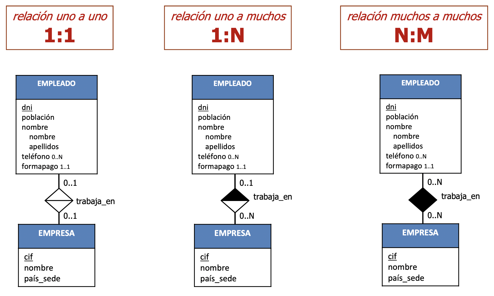

# T9: EL MODELO EER

## Metodología de diseño de Bases de Datos
El diseño de una BD siempre consta de las mismas fases
independientemente del MODELO utilizado:

En cada fase, según el modelo obtenemos un esquema o
diagrama

## Qué es y Para Qué sirve el modelo ER

Es un modelo de datos semántico gráfico
• Debe ser el primer paso en el diseño de una BD (diseño conceptual)
• Debe capturar al máximo las especificaciones del análisis de
requerimientos
• Es una visión de alto nivel, sin excesivos detalles de su futura
implementación
• Representa entidades, sus propiedades y las relaciones
existentes entre ellas.
• Describe la arquitectura persistente de datos del S.I.
• No detalles de procesos o transacciones, solo estructura de datos

NO EXISTE UNA NOTACIÓN ESTÁNDAR, NOSOTROS UTILIZAREMOS UNA DE LAS MÁS USADAS PERO
HAY OTRAS MUCHAS

## Metodología de diseño de Bases de Datos
- **Diseño conceptual:** Transformación de las
especificaciones a un EER
- **Diseño lógico:** Transformación del EER a esquema relacional
- **Diseño físico:** Transformación del esquema relacional a estructuras de la BD

## Elementos del Modelo EER

- **Entidades:** se describen por sus atributos, que pueden ser:
  - Identificador
  - Compuesto
  - Multivaluado
  - No nulo
  

- **Generalización:** tipos dentro de una entidad. Heredan las propiedades de la entidad padre y añaden las suyas propias.
La generalización puede ser:
- **Total o Parcial:** si todos los elementos de la entidad padre deben estar en alguna de las hijas o no.
- **Disjunta o Solapada:** si un elemento puede estar en varias hijas o no.

*Ejemplo de generalización total y disjunta*

## Transformación de un EER a un esquema relacional

### Modelo relacional
- Identificador (*SÓLO PUEDE EXISTIR UNA CP PERO VARIAS cAlt*):
  - Clave primaria (CP) No duplicados
  - Clave alternativa (cAlt) No nulos
- Clave ajena
- Valor no nulo
### Ejemplos de transformación:
Clave primaria y valor no nulo

Clave primaria compuesta y valor no nulo

Atributos multivaluados van a una tabla aparte

Generalización total y disjunta

## Relaciones en el esquema EER

Existen distintos tipos de relaciones:
- Binarias
  - Relaciones 1:1
  - Relaciones 1:N
  - Relaciones M:N
  - Reflexivas
- Agregaciones(entidades complejas)
- Ternarias,Cuaternarias,....N-arias
  
Existen distintas restricciones en las relaciones:
- Restricción de existencia
- Restricción de Identificador (entidades débiles)

### Relaciones binarias

#### Binarias reflexivas

#### Restricciones de existencia

- La 8:8 no puede pasarse a modelo relacional
- En las reflexivas funciona igual

#### Restricciones de identificador: "Entidades débiles"

Una entidad necesita para identificarse su identificador MAS el
identificador de otra entidad con la que esta relacionada. Sólo es posible en **relaciones 1:N**
